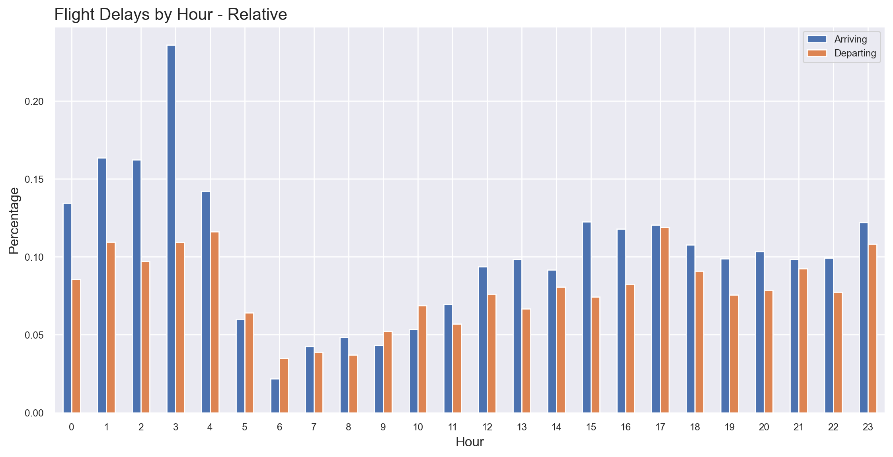

## Overview

This project was completed as the final capstone of my Data Science Immersive bootcamp at General Assembly in London.  
This document explains the background, the objectives, the methodologies, the conclusions and the tools used. The topic of flight delays was selected due to personal and professional interests within the aviation industry.  

  

## Table of Contents

* Background
* Objectives
* Data Collection
* Data Preparation & Cleaning
* Feature Engineering
* Exploratory Data Analysis
* Modelling  

  

## Background

Flight delays are not only painful for passengers, they are also a major problem for airlines.  
Flights departing after a 15-minute "grace period" are considered delayed, representing on average 21% of the total. The average delay costs the company about $1,100 USD per flight. Fuel and crew costs are, by far, the largest cost driver, followed by aircraft maintenance and ownership.  
Delays also drive the need for additional airport gates and ground staff and impose costs on airline customers in the form of lost productivity, wages and goodwill.
The aviation ecosystem would be really interested in finding the factors that have the biggest impact on flight delays, so that they can be addressed from an operational point of view. In this scenario, it is important to analyse an international airport connected to a large number of destinations.  

  

## Objectives

The goals of this project is to create a classification model which can:

- Identify the most important factors leading to a delayed flight.
- Provide insights to the airport operator in order to reduce the overall delays and improve business performance.  

  

## Data Collection

The data used for this project come from the operational database of a major international airport containing all the flights made in 2013. Furthermore, I collected the hourly meteorogical data from the Open-Meteo website.  
The raw data consisted of almost 195,000 flights and 39 features.  

  

## Data Preparation & Cleaning

The original operational database had many missing values, with several things to fix. Before merging it with the weather dataset, I had to make sure that both time columns used as keys were formatted the same.
All work was done in Python on Jupyter notebooks, and the processing revolved around:

* Identifying variables relevant to modelling, and which ones to drop.
* Creating datetime column objects.
* Interpreting continuous and categorical features.
* Converting several features into binary variables.
* Creating more model-friendly feature names.
* Translating some feature values into English.
* Exploring opportunities for new feature creation.
* Looking for erroneous or missing data.
* Imputing values.
* Removing outliers.
* Creating the target variable.  

  

## Exploratory Data Analysis
  
  

Initial EDA did not reveal meaningful correlations between the different variables and the delay.  
Some variables show a large amount of outliers, and delays account for roughly 17% of total flights, which is in line with industry average.  

  
  

  

Flights are most frequent in August and least frequent in February during the year, showing a clear seasonality over the summer months.  
On average, flights are most frequent on Fridays and least frequent on Tuesdays during the week, with the daily peak being at 16:00 and the lowest at 03:00.

  
  

  

Before moving to the modelling stage, I explored some of the trends within the data, including the relative delays per hour, day, month, airline, aircraft type, service type, country of arrival and country of destination.  

  

## Modelling

Since my target was categorical, I had to fit a classification model; the baseline accuracy, the percentage of the majority class, was 0.7375, which reflect a high skewness.
After dummification most predictors were categorical, however there were few continuous variables. I performed a stratified train/test split and rescaled the training set before running the models.  

A range of models were first tested on the dataset: Logistic Regression, K-Nearest Neighbours Classifier, Decision Tree Classifier, Random Forest Classifier, Extra Trees Classifier, Support Vector Machine Classifier, AdaBoost Classifier, Gradient Boosting Classifier, Naïve Bayes Classifier and Multi-layer Perceptron Classifier.

The best performing model in the first stage was Gradient Boosting Classifier, which achieved a CV score of 0.7756, and Logistic Regression was second best with a CV score of 0.7619.  

After the initial model testing I further investigated both models using GridSearchCV.
Gradient Boosting Classifier achieved the final CV score of 0.7805 and tended to overpredict the majority class.

  

## Limitations

## Conclusion

## Future Work

